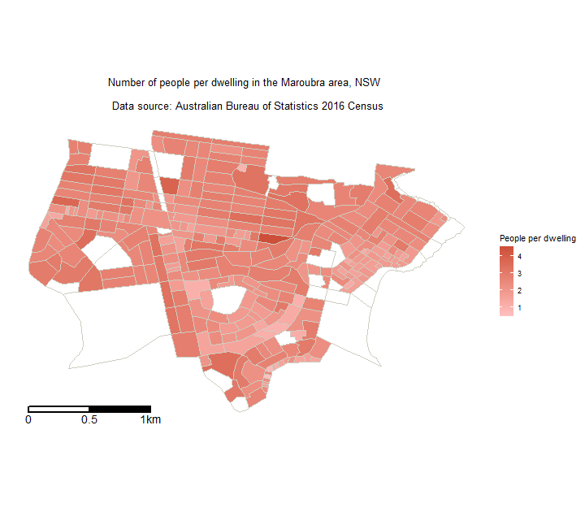
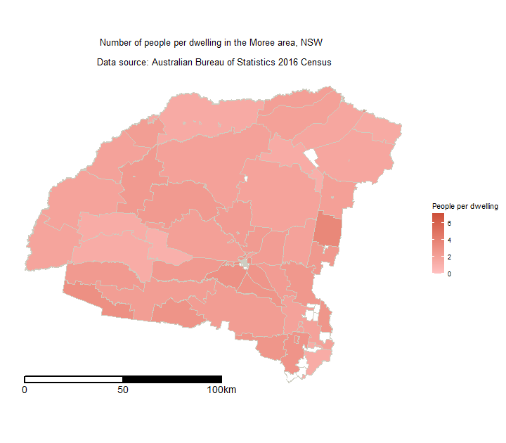

## Australian Local Population Maps

Project uses two two data sets, both from the Australian Bureau of Statistics (ABS):

1. Map data from the catalog for “1270.0.55.001 - Australian Statistical Geography Standard (ASGS): Volume 1 - Main Structure and Greater Capital City Statistical Areas, July 2016”. The ESRI (Environmental Systems Research Institute) version for the state of NSW (New South Wales Mesh Blocks ASGS Ed 2016 Digital Boundaries in ESRI Shapefile Format) zip file was used. 
https://www.abs.gov.au/AUSSTATS/abs@.nsf/DetailsPage/1270.0.55.001July%202016?OpenDocument

2. Population and housing data from the catalog “2074.0 - Census of Population and Housing: Mesh Block Counts, Australia, 2016”. The CSV version was used.
Analysis 
https://www.abs.gov.au/AUSSTATS/abs@.nsf/DetailsPage/2074.02016?OpenDocument

The map data is limited to local areas and then joined to the Housing and Population data via the mesh block id. (A “mesh block” is the smallest geographical area defined by the ABS). The number of people and number of dwellings was converted to a ratio of people per dwelling to gain insight into local population density.

This project was completed as a Data and Visual Analytics assignment at Georgia Institute of Technology.

### Maroubra
 

### Mooree
 

### References 
Australian Bureau of Statistics, 2017, 2074.0 - Census of Population and Housing: Mesh Block Counts, Australia, 2016 (Summary Page) http://www.abs.gov.au/AUSSTATS/abs@.nsf/Lookup/2074.0Main+Features12016?OpenDocument

Dervieux, C., 2017 Plotting Polygon Shape Files
https://github.com/tidyverse/ggplot2/wiki/plotting-polygon-shapefiles

Johnson, K., 2015. Making Maps in R
http://www.kevjohnson.org/making-maps-in-r/

Lovelace, R., 2017 Introduction to visualizing spatial data in R
https://cran.r-project.org/doc/contrib/intro-spatial-rl.pdf

Saunders, N., 2015 Where no-one lives in Sydney: a comparison of Hornsby and the Eastern Suburbs.
https://rstudio-pubs-static.s3.amazonaws.com/60265_2bd33de8934b461b94215de1e082232c.html